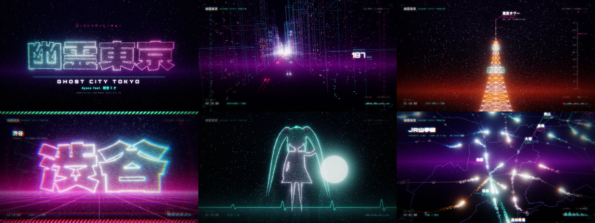

# 幽霊東京 · Ghost City Tokyo — particle PV

非官方同人 PV（fan-made）：**幽霊東京 / Ayase feat. 初音ミク**。
术力口风格的霓虹赛博朋克粒子动画，用 WebGL2 实时渲染，十几万个粒子在东京真实的铁路网、街道、东京塔、涩谷十字路口和文字之间变形流动，跟着 124 BPM 的节拍卡点。



## 怎么看

```bash
npx serve .          # 或者 python3 -m http.server
# 打开 http://localhost:3000
```

开始界面有三个选项：

| 按钮 | 作用 |
| --- | --- |
| **PLAY (demo beat)** | 用内置的原创伴奏播放（124 BPM、C 小调，和原曲同速同调，但**不是原曲**） |
| **LOAD SONG FILE** | 载入你自己的 `幽霊東京` 音频文件，画面按时间轴同步 |
| **VISUALS ONLY** | 无声只看画面 |

- 把音频文件和 `.lrc` 歌词文件直接**拖进页面**即可同步播放，歌词会以逐字弹出的方式显示（模板见 `lyrics/template.lrc`）。
- 底部 `OFFSET` 用来对齐：画面时间 = 音频时间 + offset（秒）。如果你的音源前奏长短不一样，在这里微调。
- `● REC` 直接把画布 + 音频录成 WebM 下载，用来导出带原曲的 PV。
- 快捷键：空格 播放/暂停 · ←/→ 前后跳 2 小节 · F 全屏 · H 隐藏控制栏
- URL 参数：`?audio=song.mp3&lrc=lyrics/song.lrc&offset=0.3`（自动载入）、`?n=65536`（粒子数，低配电脑用）、`?q=0.6`（分辨率倍率）

## 离线渲染成视频

逐帧确定性渲染（headless Chromium + ffmpeg），任意分辨率、帧率都不会掉帧：

```bash
node tools/render.mjs                                         # 1280x720@30，内置伴奏
node tools/render.mjs --width 1920 --height 1080 --fps 60 \
     --audio 幽霊東京.mp3 --offset 0                           # 用原曲渲染 1080p60
node tools/render.mjs --from 60 --to 75 --out renders/chorus.mp4
node tools/render.mjs --stills 5,20,64 --out renders/stills   # 截图
```

其他参数：`--crf 20`、`--maxrate 8M`、`--grain 0.35`（胶片颗粒，越低文件越小）、`--particles 131072`、`--mute`。需要 Node 18+、`playwright` 和 `ffmpeg`。

## 分镜（124 BPM，1 小节 ≈ 1.935 秒）

| 时间 | 小节 | 场景 |
| --- | --- | --- |
| 0:00 | 1–8 | **BOOT 起動** — 终端开机日志 → 粒子聚成「幽霊東京」→ 幽/霊/東/京 一拍一闪的色块切镜 |
| 0:15 | 9–24 | **RAILNET 鉄道網** — 真实东京 23 区边界 + 37 条线路，每条线上跑着按官方线路色发光的「列车」粒子，主要车站逐拍弹出标注和经纬度 |
| 0:46 | 25–32 | **NEON AVENUE 夜行** — 高速穿过霓虹大街：线框楼、窗灯、竖排招牌、车流尾灯、雨 |
| 1:02 | 33–48 | **CHORUS** — 粒子大字每 2 小节变形：幽霊 / 東京 / GHOST / CITY / ネオン / 亡霊 / 夜行，背景霓虹网格 + 隧道 + 滚动字幕带 |
| 1:33 | 49–52 | **TOKYO TOWER 333m** — 粒子格构东京塔，幽灵粒子环绕 |
| 1:41 | 53–64 | **SHIBUYA 交差点** — 俯视涩谷十字路口，成千上万的幽灵行人斜穿马路 |
| 2:04 | 65–70 | **DATA RAIN 電脳** — 片假名数据雨 + 3·2·1·0 倒数 |
| 2:15 | 71–84 | **CHORUS II** — 新宿 / 渋谷 / 池袋 / 秋葉原 … 字形 + 坐标 |
| 2:43 | 85–92 | **BRIDGE 幽** — 双马尾的幽灵少女剪影、月亮、心电图逐渐变平 → SIGNAL LOST → 再・起・動 |
| 2:58 | 93–102 | **FINAL 終点** — 沿着山手线贴地飞行，车站从身边掠过 → 最终副歌 |
| 3:17 | 103–108 | **END おやすみ** — 粒子漩涡收束成标题，制作信息 |

分镜、关键帧、相机、后期全部在 `src/timeline.js` 里，按小节写的；原曲结构不一样的话直接改小节数即可。

## 素材来源（全部为开放授权，网上搜集）

- **东京 23 区行政边界**：地球地图日本（国土地理院 GSI Global Map Japan），经 [dataofjapan/land](https://github.com/dataofjapan/land) 转换的 GeoJSON。非商用需注明出处。
- **铁路车站坐标与线路**：[japan-train-data](https://www.npmjs.com/package/japan-train-data)（MIT, Marco Lüthy），原始数据来自 [駅データ.jp](https://ekidata.jp/)。
- **地标坐标**：东京塔、晴空塔、涩谷十字路口、都厅等公开经纬度。
- **字体**（SIL Open Font License，已按用到的字裁剪为 woff2）：Dela Gothic One、DotGothic16、Zen Kaku Gothic New、Orbitron、Share Tech Mono —— 来自 [google/fonts](https://github.com/google/fonts)。
- **歌曲信息**：BPM 124 / C 小调 / 4/4 来自 [ChordWiki](https://ja.chordwiki.org/wiki/%E5%B9%BD%E9%9C%8A%E6%9D%B1%E4%BA%AC)、[songbpm](https://songbpm.com/@ayase/you-ling-dong-jing-V0OflATRA3) 等公开资料。

重新生成数据 / 字体：

```bash
curl -LO https://raw.githubusercontent.com/dataofjapan/land/master/tokyo.geojson
npm pack japan-train-data@0.6.0 && tar xzf japan-train-data-0.6.0.tgz
node tools/build-data.mjs tokyo.geojson package/dist/bundle.cjs.js
python3 tools/subset-fonts.py <放 google/fonts 原始 ttf 的目录>
```

## 版权说明

《幽霊東京》词曲为 Ayase，演唱为初音ミク（Crypton Future Media）。本仓库**不包含原曲音频和歌词**；画面里的双马尾幽灵是原创的剪影，不使用任何官方立绘。内置伴奏是按同样速度和调性原创的 demo，仅用于在没有音源时预览卡点。

## 结构

```
index.html            播放器页面
src/main.js           启动、控制栏、录制、离线渲染接口 window.PV
src/timeline.js       分镜：场景、粒子关键帧、相机、后期、2D 叠加层
src/shapes.js         粒子形态生成（地图/街道/东京塔/十字路口/字形/幽灵/漩涡）
src/renderer.js       WebGL2 渲染：粒子、线框、背景、Bloom、合成
src/shaders.js        GLSL（粒子在 GPU 上沿路径流动、隧道、雨、变形爆散）
src/ui.js             HUD、色块切镜、标注、滚动字幕、歌词
src/audio.js          音频引擎、原创 demo 伴奏合成器、LRC 解析
src/data/tokyo.js     生成的东京地理数据
tools/                数据构建、字体裁剪、离线渲染脚本
```
